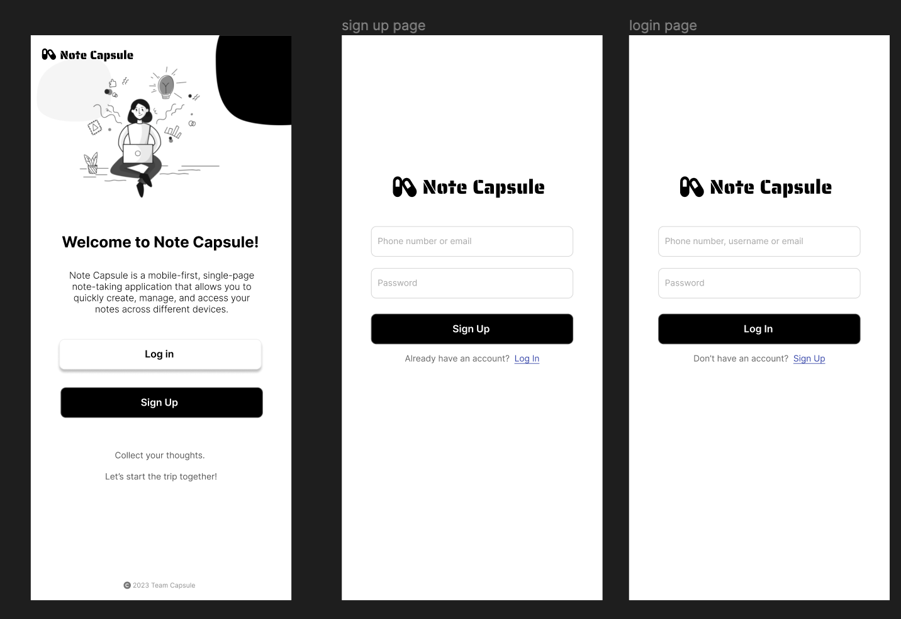

# Module 2 Group Assignment

CSCI 5117, Spring 2023, [assignment description](https://canvas.umn.edu/courses/355584/pages/project-2)

## App Info:

- Team Name: Capsule
- App Name: Note Capsule
- App Link: https://note-capsule.netlify.app/

Project Overview

Note Capsule aims to solve the issue of taking, organizing, and accessing notes quickly and efficiently across multiple devices. The application targets anyone who values structured and easy-to-access note-taking, such as students, professionals, writers, and researchers. Unlike other note-taking applications, Note Capsule offers a unique blend of simplicity, flexibility, and powerful features. Our focus on a clean, responsive interface, auto-saving, multimedia integration, and real-time collaboration sets us apart from the competition.

### Students

- Youfu Yan, yan00111@umn.edu
- Isabel Dahl, dahl1199@umn.edu
- Marcellinus, Steven Sugiarto sugia005@umn.edu
- Ying Lu, lu000097@umn.edu
- Ola Oladeji, olade014@umn.edu

## Key Features

**Describe the most challenging features you implemented
(one sentence per bullet, maximum 4 bullets):**

- User Authentication(Clerk): Secure sign up and login functionality using Clerk.js with options for email, Google, or other social media logins.
- Notes Dashboard: Display a list of all notes with options to
  2.1 filter, 2.2 sort, 2.3 search, and organize them using 2.4 Folder. 2.5 Dark mode allows users to customize the interface to their liking.
- Note Editor: Rich text editor based on Quill.js that allows users to create, edit, and format notes with options for adding images, links, taking photos using the device's camera, and export notes as PDFs.
- Others: Automatically save notes as users type to prevent data loss using react hook. Image hosting using ImageKit.io which adapts from Project 1.

Which (if any) device integration(s) does your app support?

- Iphone SE
- Pixel 5
- and more mobile devices

Which (if any) progressive web app feature(s) does your app support?

- Responsive Design: Our application is mobile-first and designed to adapt to different screen sizes. This is a core principle of PWAs, ensuring a consistent user experience across a range of devices.

## Mockup images

**[Figma Prototype](https://www.figma.com/file/DR1Oxyx95T2sGyJcsxmc0v/Project2-LoFi?node-id=0%3A1&t=oNErMmuOGw5AKvIc-1) along with a very brief caption:**

### Login Page

### Dashboard Page

### Note Editor Page

## Testing Notes

**Is there anything special we need to know in order to effectively test your app? (optional):**

- User need login first to use and test the app.

## Screenshots of Site (complete)

[Add a screenshot of each key page](https://stackoverflow.com/questions/10189356/how-to-add-screenshot-to-readmes-in-github-repository)
along with a very brief caption:\*\*

### Login Page

### Dashboard Page (Mobile)

### Dashboard Page (Desktop)

### Note Editor Page (Mobile)

## External Dependencies

**Document integrations with 3rd Party code or services here.
Please do not document required libraries (e.g., Vue, Vuefire, Firebase).**

- Clerk: User Authentication
- Quill.js: Note Editor
- React-Webcam: Webcam Integration
- ImageKit: Image Hosting
- Bootstrap: CSS Framework
- jspdf: PDF Generation

**If there's anything else you would like to disclose about how your project
relied on external code, expertise, or anything else, please disclose that
here:**

- Future Features: Real-time collaboration, Data security and Privacy, Push notifications, and more.
